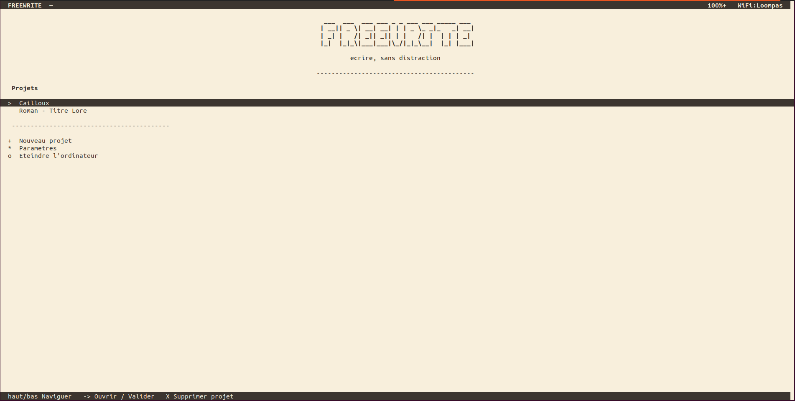

# DistracFreeWrite

Un environnement d'écriture minimaliste pour terminal, conçu pour tourner sur un PC Debian sans interface graphique. Pas de souris, pas de notifications, pas de distractions — uniquement le texte.

Idéal pour transformer un vieux PC en machine à écrire dédiée.

---

## Aperçu



[Éditeur](docs/editor.png) · [Navigateur de fichiers](docs/navigator.png) · [Paramètres](docs/settings.png) · [Thème sombre](docs/theme-sombre.png) · [Thème clair](docs/theme-clair.png) · [Thème doux](docs/theme-doux.png)

---

## Installation

```bash
curl -fsSL https://raw.githubusercontent.com/VSerain/distraction-free-write/main/install.sh | sudo bash
```

Le script installe les dépendances, copie l'application dans `/opt/distracfreewrite` et propose d'activer le démarrage automatique au boot (connexion automatique sur TTY1).

Une fois installé :

```bash
distracfreewrite
```

### Prérequis

- Debian 12+ (ou dérivé)
- Python 3.10+
- `git`, `nmcli` (NetworkManager), `openssh-client`

---

## Fonctionnalités

### Éditeur de texte

- **Plein écran sans distraction** — aucune barre, aucun indicateur, uniquement le texte
- **Sauvegarde automatique** à chaque frappe — pas de notion de fichier non sauvegardé
- **Retour à la ligne automatique** (word wrap) — les longues lignes s'affichent sur plusieurs lignes visuelles sans ajouter de `\n` dans le fichier
- **Marges configurables** — marge latérale et verticale réglables de 0 à 8 caractères (défaut : 1)
- **Sélection de texte** avec `Shift+flèche` ou `Ctrl+Espace` puis flèches — la sélection est mise en évidence ; `Backspace`, `Suppr` ou toute frappe efface/remplace la sélection
- **Curseur repositionné à la dernière position** à l'ouverture d'un fichier

| Touche | Action |
|--------|--------|
| `↑` `↓` `←` `→` | Déplacer le curseur (navigation visuelle sur les lignes wrappées) |
| `Ctrl+←` / `Ctrl+→` | Début / fin de ligne |
| `Shift+←` / `Shift+→` | Étendre la sélection caractère par caractère |
| `Shift+↑` / `Shift+↓` | Étendre la sélection à la ligne du dessus / dessous |
| `Ctrl+Espace` | Poser / lever l'ancre de sélection |
| `Home` / `End` | Début / fin de ligne |
| `PgUp` / `PgDn` | Défiler d'une page |
| `Backspace` / `Suppr` | Effacer (ou supprimer la sélection) |
| `Entrée` | Nouvelle ligne |
| `Tab` | Insérer 4 espaces |
| `ESC` / `Ctrl+Q` | Quitter l'éditeur |

---

### Gestionnaire de projets

- Projets stockés dans `~/Projets`, un dossier par projet
- Explorateur de fichiers à deux panneaux (liste à gauche, aperçu à droite)
- **Mémorisation du dernier fichier ouvert** par projet
- Affichage de l'**âge depuis la dernière sauvegarde** et de la **taille** de chaque fichier

| Touche | Action |
|--------|--------|
| `↑` `↓` | Naviguer |
| `→` / `Entrée` | Ouvrir le fichier ou entrer dans le dossier |
| `←` | Remonter d'un niveau |
| `F` | Nouveau fichier |
| `D` | Nouveau dossier |
| `R` | Renommer |
| `C` | Dupliquer |
| `M` | Déplacer |
| `X` | Supprimer (confirmation) |
| `U` | Exporter sur clé USB |
| `G` | Ouvrir la page Git |

---

### Git intégré

Accessible avec `G` depuis la racine d'un projet.

- Affiche la branche courante, les modifications locales, les commits en avance/retard
- **Voir les modifications en cours** (diff par rapport au dernier commit)
- Commit, push, pull, création et changement de branche
- Historique des commits avec aperçu des modifications et restauration à un commit antérieur
- Gestion de la clé SSH (génération `ed25519`, affichage, export USB)
- **Gestion automatique du WiFi** : si l'option "WiFi off hors git" est activée, le WiFi est réactivé automatiquement avant chaque opération et coupé ensuite

---

### Paramètres

Accessible depuis l'écran d'accueil.

| Paramètre | Valeurs | Description |
|-----------|---------|-------------|
| Thème | Sombre / Clair / Doux | Doux = fond crème, texte brun-gris, conçu pour l'écriture longue durée |
| Marge latérale | 0 – 8 | Espace à gauche et à droite du texte dans l'éditeur |
| Marge verticale | 0 – 8 | Espace en haut et en bas du texte dans l'éditeur |
| WiFi off hors git | on / off | Coupe le WiFi en permanence sauf pendant les opérations Git et les mises à jour |
| Connexion WiFi | — | Scanner et se connecter à un réseau |
| Mise à jour | — | Télécharger et installer la dernière version depuis GitHub |
| Démarrage automatique | on / off | Lancer DistracFreeWrite automatiquement au démarrage du PC |

Pour quitter l'application et revenir au terminal : **Paramètres → Fermer DistracFreeWrite**.

---

### Export USB

- Détection automatique des clés USB montées
- Copie du projet sans le dossier `.git`
- Vérification de l'espace disponible avant la copie

---

### Statut système

Affiché dans la barre de titre (sauf dans l'éditeur) :

```
DISTRACFREEWRITE  —  Mon projet          78%+   WiFi:MaBox
```

- `78%` — batterie, `+` si en charge
- `WiFi:MaBox` — réseau connecté, `WiFi:--` si déconnecté, `WiFi:OFF` si radio coupée

---

## Structure des données

```
~/Projets/                   ← projets
    mon-roman/
        chapitre-1.txt
        notes/

~/.config/distracfreewrite/
    config.json              ← préférences (thème, marges, WiFi…)

/opt/distracfreewrite/
    main.py                  ← application

~/.ssh/
    id_ed25519               ← clé SSH (si générée depuis l'app)
```

---

## Mise à jour

Depuis l'application : **Paramètres → Installer la dernière version**.

Ou manuellement :

```bash
curl -fsSL https://raw.githubusercontent.com/VSerain/distraction-free-write/main/install.sh | sudo bash
```

---

## Contribuer

Les issues et les PR sont les bienvenues — qu'il s'agisse de signaler un bug, proposer une idée ou soumettre une amélioration.

Ce projet est développé sur le temps libre, sans engagement commercial. Les contributions sont traitées au fil du temps, sans délai garanti. Merci de votre compréhension.
